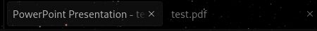

# PDF Title Remover

## Overview

The PDF Title Remover is a Node.js script that processes PDF files to remove their titles. This means that when you view the PDF documents in a browser, the filename will be displayed instead of the title. This script works well together with a PowerPoint to PDF converter, allowing you to convert presentations to PDFs and then clean up the titles for a more consistent file naming experience.

## Prerequisites

- Node.js installed on your machine.

## Installation

1. Clone the repository or download the script files.
2. Navigate to the project directory in your terminal.

## Usage

1. **Place PDF Files**:
   - Place the PDF files you want to process inside the `in` directory.

2. **Run the Script**:
   Execute the script to start the title removal process:

   ```bash
   npm start
   ```

3. **View Results**:
   After the script completes, the output will be displayed in the console, showing details about the processing of the PDF files. The cleaned PDFs will be saved in the `out` directory.

## Output

Below is a screenshot showing the browser tab name of the document `test.pdf` before and after cleaning:



